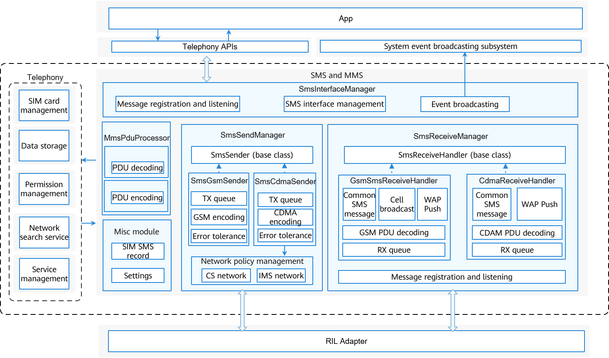

# SMS and MMS<a name="EN-US_TOPIC_0000001105544742"></a>

-   [Introduction](#section117mcpsimp)
-   [Directory Structure](#section125mcpsimp)
-   [Constraints](#section129mcpsimp)
-   [Available APIs](#section134mcpsimp)
-   [Usage Guidelines](#section170mcpsimp)
    -   [Sending SMS Messages](#section172mcpsimp)
    -   [Creating a ShortMessage Object](#section181mcpsimp)

-   [Repositories Involved](#section189mcpsimp)

## Introduction<a name="section117mcpsimp"></a>

The SMS and MMS module provides the capabilities of sending and receiving short message service \(SMS\) messages and encoding and decoding multimedia messaging service \(MMS\) messages for mobile data users. Its main functions include the following: GSM/CDMA SMS message receiving and sending, SMS protocol data unit \(PDU\) encoding and decoding, WAP Push message receiving and processing, cell broadcast message receiving, MMS message notification, MMS message encoding and decoding, and SIM SMS record management.

**Figure  1**  Architecture of the SMS and MMS module<a name="fig420553511549"></a>


The SMS and MMS module consists of four major parts:

-   SmsInterfaceManager: provides external APIs for sending SMS messages and managing SIM SMS records. It can be used to create  **SmsSendManager**  and  **SmsReceiveManager**  objects.
-   SmsSendManager: sends SMS messages and listens to IMS network status changes. It can be used to create  **GsmSmsSender**  and  **CdmaSmsSender**  objects and schedule either object based on the radio access technology \(RAT\) to send SMS messages.
-   SmsReceiveManager: receives SMS messages and listens to new SMS messages from the RIL Adapter layer. It can be used to create  **GsmSmsReceiveHandler**  and  **CdmaSmsReceiveHandler**  objects as well as the  **SmsWapPushHandler**  and  **SmsCellBroadcastHandler**  objects.
-   MmsPduProcessor: encodes and decodes MMS PDUs.

## Directory Structure<a name="section125mcpsimp"></a>

```
/OpenHarmony_Standard_System/base/telephony/sms_mms
├─ interfaces               # External APIs
│  └─ kits
├─ sa_profile               # SA profile
├─ services                 # Service code
│  ├─ include               # Header files
│  ├─ cdma                  # CDMA source files
│  └─ gsm                   # GSM source files
├─ test                     # Unit test code
└─ utils                    # Utilities
```

## Constraints<a name="section129mcpsimp"></a>

-   Programming language: JavaScript
-   In terms of software, this module needs to work with the telephony core service \(core\_service\) and depends on the  [glib](https://gitlab.gnome.org/GNOME/glib).
-   In terms of hardware, the accommodating device must be equipped with a modem and a SIM card capable of independent cellular communication.

## Available APIs<a name="section134mcpsimp"></a>

**Table  1**  External APIs provided by the SMS and MMS module

<a name="table136mcpsimp"></a>
<table><thead align="left"><tr id="row142mcpsimp"><th class="cellrowborder" valign="top" width="33.33333333333333%" id="mcps1.2.4.1.1"><p id="entry143mcpsimpp0"><a name="entry143mcpsimpp0"></a><a name="entry143mcpsimpp0"></a>API</p>
</th>
<th class="cellrowborder" valign="top" width="33.33333333333333%" id="mcps1.2.4.1.2"><p id="entry144mcpsimpp0"><a name="entry144mcpsimpp0"></a><a name="entry144mcpsimpp0"></a>Description</p>
</th>
<th class="cellrowborder" valign="top" width="33.33333333333333%" id="mcps1.2.4.1.3"><p id="entry145mcpsimpp0"><a name="entry145mcpsimpp0"></a><a name="entry145mcpsimpp0"></a>Required Permission</p>
</th>
</tr>
</thead>
<tbody><tr id="row146mcpsimp"><td class="cellrowborder" valign="top" width="33.33333333333333%" headers="mcps1.2.4.1.1 "><p id="p1011717318415"><a name="p1011717318415"></a><a name="p1011717318415"></a>function sendMessage(options: SendMessageOptions): void;</p>
</td>
<td class="cellrowborder" valign="top" width="33.33333333333333%" headers="mcps1.2.4.1.2 "><p id="entry148mcpsimpp0"><a name="entry148mcpsimpp0"></a><a name="entry148mcpsimpp0"></a>Sends SMS messages, including long messages, common messages, and data messages.</p>
</td>
<td class="cellrowborder" valign="top" width="33.33333333333333%" headers="mcps1.2.4.1.3 "><p id="entry149mcpsimpp0"><a name="entry149mcpsimpp0"></a><a name="entry149mcpsimpp0"></a>SystemPermission.SEND_MESSAGES</p>
</td>
</tr>
<tr id="row166mcpsimp"><td class="cellrowborder" valign="top" width="33.33333333333333%" headers="mcps1.2.4.1.1 "><p id="entry167mcpsimpp0"><a name="entry167mcpsimpp0"></a><a name="entry167mcpsimpp0"></a>function createMessage(pdu: Array&lt;number&gt;, specification: string, callback: AsyncCallback&lt;ShortMessage&gt;): void;</p>
</td>
<td class="cellrowborder" valign="top" width="33.33333333333333%" headers="mcps1.2.4.1.2 "><p id="p43948592416"><a name="p43948592416"></a><a name="p43948592416"></a>Creates and parses <strong id="b191003398102"><a name="b191003398102"></a><a name="b191003398102"></a>ShortMessage</strong> objects based on PDUs.</p>
</td>
<td class="cellrowborder" valign="top" width="33.33333333333333%" headers="mcps1.2.4.1.3 "><p id="entry169mcpsimpp0"><a name="entry169mcpsimpp0"></a><a name="entry169mcpsimpp0"></a>None</p>
</td>
</tr>
</tbody>
</table>

**Table  2**  Parameter description of SendMessageOptions

<a name="table137771821149"></a>
<table><thead align="left"><tr id="row16777142181416"><th class="cellrowborder" valign="top" width="25%" id="mcps1.2.5.1.1"><p id="p1677762111420"><a name="p1677762111420"></a><a name="p1677762111420"></a>Parameter</p>
</th>
<th class="cellrowborder" valign="top" width="25%" id="mcps1.2.5.1.2"><p id="p32826484210"><a name="p32826484210"></a><a name="p32826484210"></a>Type</p>
</th>
<th class="cellrowborder" valign="top" width="25%" id="mcps1.2.5.1.3"><p id="p117778231415"><a name="p117778231415"></a><a name="p117778231415"></a>Description</p>
</th>
<th class="cellrowborder" valign="top" width="25%" id="mcps1.2.5.1.4"><p id="p1725516817152"><a name="p1725516817152"></a><a name="p1725516817152"></a>Mandatory</p>
</th>
</tr>
</thead>
<tbody><tr id="row1577719210142"><td class="cellrowborder" valign="top" width="25%" headers="mcps1.2.5.1.1 "><p id="p197771201411"><a name="p197771201411"></a><a name="p197771201411"></a>slotId</p>
</td>
<td class="cellrowborder" valign="top" width="25%" headers="mcps1.2.5.1.2 "><p id="p16282184822111"><a name="p16282184822111"></a><a name="p16282184822111"></a>number</p>
</td>
<td class="cellrowborder" valign="top" width="25%" headers="mcps1.2.5.1.3 "><p id="p07777221417"><a name="p07777221417"></a><a name="p07777221417"></a>SIM card slot ID</p>
</td>
<td class="cellrowborder" valign="top" width="25%" headers="mcps1.2.5.1.4 "><p id="p22552080151"><a name="p22552080151"></a><a name="p22552080151"></a>Yes</p>
</td>
</tr>
<tr id="row177779231416"><td class="cellrowborder" valign="top" width="25%" headers="mcps1.2.5.1.1 "><p id="p12777928146"><a name="p12777928146"></a><a name="p12777928146"></a>destinationHost</p>
</td>
<td class="cellrowborder" valign="top" width="25%" headers="mcps1.2.5.1.2 "><p id="p19282948182112"><a name="p19282948182112"></a><a name="p19282948182112"></a>string</p>
</td>
<td class="cellrowborder" valign="top" width="25%" headers="mcps1.2.5.1.3 "><p id="p157771125144"><a name="p157771125144"></a><a name="p157771125144"></a>Phone number of the recipient</p>
</td>
<td class="cellrowborder" valign="top" width="25%" headers="mcps1.2.5.1.4 "><p id="p192550811156"><a name="p192550811156"></a><a name="p192550811156"></a>Yes</p>
</td>
</tr>
<tr id="row20777162111419"><td class="cellrowborder" valign="top" width="25%" headers="mcps1.2.5.1.1 "><p id="p1777814218147"><a name="p1777814218147"></a><a name="p1777814218147"></a>serviceCenter</p>
</td>
<td class="cellrowborder" valign="top" width="25%" headers="mcps1.2.5.1.2 "><p id="p0282348112110"><a name="p0282348112110"></a><a name="p0282348112110"></a>string</p>
</td>
<td class="cellrowborder" valign="top" width="25%" headers="mcps1.2.5.1.3 "><p id="p137781826141"><a name="p137781826141"></a><a name="p137781826141"></a>SMC address</p>
</td>
<td class="cellrowborder" valign="top" width="25%" headers="mcps1.2.5.1.4 "><p id="p1025511815152"><a name="p1025511815152"></a><a name="p1025511815152"></a>No</p>
</td>
</tr>
<tr id="row187781529145"><td class="cellrowborder" valign="top" width="25%" headers="mcps1.2.5.1.1 "><p id="p1377810211419"><a name="p1377810211419"></a><a name="p1377810211419"></a>content</p>
</td>
<td class="cellrowborder" valign="top" width="25%" headers="mcps1.2.5.1.2 "><p id="p6282648152118"><a name="p6282648152118"></a><a name="p6282648152118"></a>content | Array&lt;number&gt;</p>
</td>
<td class="cellrowborder" valign="top" width="25%" headers="mcps1.2.5.1.3 "><p id="p47789219147"><a name="p47789219147"></a><a name="p47789219147"></a>SMS content</p>
</td>
<td class="cellrowborder" valign="top" width="25%" headers="mcps1.2.5.1.4 "><p id="p325517891510"><a name="p325517891510"></a><a name="p325517891510"></a>Yes</p>
</td>
</tr>
<tr id="row37780215141"><td class="cellrowborder" valign="top" width="25%" headers="mcps1.2.5.1.1 "><p id="p37784221410"><a name="p37784221410"></a><a name="p37784221410"></a>destinationPort</p>
</td>
<td class="cellrowborder" valign="top" width="25%" headers="mcps1.2.5.1.2 "><p id="p1428274815211"><a name="p1428274815211"></a><a name="p1428274815211"></a>number</p>
</td>
<td class="cellrowborder" valign="top" width="25%" headers="mcps1.2.5.1.3 "><p id="p87781524149"><a name="p87781524149"></a><a name="p87781524149"></a>Port number for receiving messages</p>
</td>
<td class="cellrowborder" valign="top" width="25%" headers="mcps1.2.5.1.4 "><p id="p7255386157"><a name="p7255386157"></a><a name="p7255386157"></a>Yes (for sending of data messages)</p>
</td>
</tr>
<tr id="row14778152151417"><td class="cellrowborder" valign="top" width="25%" headers="mcps1.2.5.1.1 "><p id="p1877814231418"><a name="p1877814231418"></a><a name="p1877814231418"></a>sendCallback</p>
</td>
<td class="cellrowborder" valign="top" width="25%" headers="mcps1.2.5.1.2 "><p id="p3283448172111"><a name="p3283448172111"></a><a name="p3283448172111"></a>AsyncCallback&lt;ISendShortMessageCallback&gt;</p>
</td>
<td class="cellrowborder" valign="top" width="25%" headers="mcps1.2.5.1.3 "><p id="p16778182121416"><a name="p16778182121416"></a><a name="p16778182121416"></a>Callback of the sending result</p>
</td>
<td class="cellrowborder" valign="top" width="25%" headers="mcps1.2.5.1.4 "><p id="p7255108141513"><a name="p7255108141513"></a><a name="p7255108141513"></a>Yes</p>
</td>
</tr>
<tr id="row107782241418"><td class="cellrowborder" valign="top" width="25%" headers="mcps1.2.5.1.1 "><p id="p147781321142"><a name="p147781321142"></a><a name="p147781321142"></a>deliveryCallback</p>
</td>
<td class="cellrowborder" valign="top" width="25%" headers="mcps1.2.5.1.2 "><p id="p172835481214"><a name="p172835481214"></a><a name="p172835481214"></a>AsyncCallback&lt;IDeliveryShortMessageCallback&gt;</p>
</td>
<td class="cellrowborder" valign="top" width="25%" headers="mcps1.2.5.1.3 "><p id="p5778624149"><a name="p5778624149"></a><a name="p5778624149"></a>Callback of the delivery report</p>
</td>
<td class="cellrowborder" valign="top" width="25%" headers="mcps1.2.5.1.4 "><p id="p172553821519"><a name="p172553821519"></a><a name="p172553821519"></a>Yes</p>
</td>
</tr>
</tbody>
</table>

**Table  3**  Description of ISendShortMessageCallback types

<a name="table6490122972417"></a>
<table><thead align="left"><tr id="row194901529162416"><th class="cellrowborder" valign="top" width="33.33333333333333%" id="mcps1.2.4.1.1"><p id="p849172910245"><a name="p849172910245"></a><a name="p849172910245"></a>Parameter</p>
</th>
<th class="cellrowborder" valign="top" width="33.33333333333333%" id="mcps1.2.4.1.2"><p id="p849182916242"><a name="p849182916242"></a><a name="p849182916242"></a>Type</p>
</th>
<th class="cellrowborder" valign="top" width="33.33333333333333%" id="mcps1.2.4.1.3"><p id="p144911029162413"><a name="p144911029162413"></a><a name="p144911029162413"></a>Description</p>
</th>
</tr>
</thead>
<tbody><tr id="row16491142916241"><td class="cellrowborder" valign="top" width="33.33333333333333%" headers="mcps1.2.4.1.1 "><p id="p549162942410"><a name="p549162942410"></a><a name="p549162942410"></a>result</p>
</td>
<td class="cellrowborder" valign="top" width="33.33333333333333%" headers="mcps1.2.4.1.2 "><p id="p144911129112418"><a name="p144911129112418"></a><a name="p144911129112418"></a>SendSmsResult</p>
</td>
<td class="cellrowborder" valign="top" width="33.33333333333333%" headers="mcps1.2.4.1.3 "><p id="p14491129172419"><a name="p14491129172419"></a><a name="p14491129172419"></a>Sending result</p>
</td>
</tr>
<tr id="row204911029112418"><td class="cellrowborder" valign="top" width="33.33333333333333%" headers="mcps1.2.4.1.1 "><p id="p4491172917241"><a name="p4491172917241"></a><a name="p4491172917241"></a>url</p>
</td>
<td class="cellrowborder" valign="top" width="33.33333333333333%" headers="mcps1.2.4.1.2 "><p id="p1549132914244"><a name="p1549132914244"></a><a name="p1549132914244"></a>string</p>
</td>
<td class="cellrowborder" valign="top" width="33.33333333333333%" headers="mcps1.2.4.1.3 "><p id="p349115291248"><a name="p349115291248"></a><a name="p349115291248"></a>URL</p>
</td>
</tr>
<tr id="row19491172912247"><td class="cellrowborder" valign="top" width="33.33333333333333%" headers="mcps1.2.4.1.1 "><p id="p54911329122419"><a name="p54911329122419"></a><a name="p54911329122419"></a>isLastPart</p>
</td>
<td class="cellrowborder" valign="top" width="33.33333333333333%" headers="mcps1.2.4.1.2 "><p id="p154918290248"><a name="p154918290248"></a><a name="p154918290248"></a>boolean</p>
</td>
<td class="cellrowborder" valign="top" width="33.33333333333333%" headers="mcps1.2.4.1.3 "><p id="p104913290240"><a name="p104913290240"></a><a name="p104913290240"></a>Whether the SMS message is the last one</p>
</td>
</tr>
</tbody>
</table>

**Table  4**  Description of SendSmsResult enum values

<a name="table2375639122617"></a>
<table><thead align="left"><tr id="row1376123932614"><th class="cellrowborder" valign="top" width="33.33333333333333%" id="mcps1.2.4.1.1"><p id="p2376339102616"><a name="p2376339102616"></a><a name="p2376339102616"></a>Name</p>
</th>
<th class="cellrowborder" valign="top" width="33.33333333333333%" id="mcps1.2.4.1.2"><p id="p153769391263"><a name="p153769391263"></a><a name="p153769391263"></a>Value</p>
</th>
<th class="cellrowborder" valign="top" width="33.33333333333333%" id="mcps1.2.4.1.3"><p id="p6376193918267"><a name="p6376193918267"></a><a name="p6376193918267"></a>Description</p>
</th>
</tr>
</thead>
<tbody><tr id="row1376103912610"><td class="cellrowborder" valign="top" width="33.33333333333333%" headers="mcps1.2.4.1.1 "><p id="p0376113932616"><a name="p0376113932616"></a><a name="p0376113932616"></a>SEND_SMS_SUCCESS</p>
</td>
<td class="cellrowborder" valign="top" width="33.33333333333333%" headers="mcps1.2.4.1.2 "><p id="p3376193932611"><a name="p3376193932611"></a><a name="p3376193932611"></a>0</p>
</td>
<td class="cellrowborder" valign="top" width="33.33333333333333%" headers="mcps1.2.4.1.3 "><p id="p1737613982617"><a name="p1737613982617"></a><a name="p1737613982617"></a>Sending succeeded.</p>
</td>
</tr>
<tr id="row20376143917261"><td class="cellrowborder" valign="top" width="33.33333333333333%" headers="mcps1.2.4.1.1 "><p id="p2037653913260"><a name="p2037653913260"></a><a name="p2037653913260"></a>SEND_SMS_FAILURE_UNKNOWN</p>
</td>
<td class="cellrowborder" valign="top" width="33.33333333333333%" headers="mcps1.2.4.1.2 "><p id="p4376139182611"><a name="p4376139182611"></a><a name="p4376139182611"></a>1</p>
</td>
<td class="cellrowborder" valign="top" width="33.33333333333333%" headers="mcps1.2.4.1.3 "><p id="p153761539102611"><a name="p153761539102611"></a><a name="p153761539102611"></a>Sending failed due to an unknown reason.</p>
</td>
</tr>
<tr id="row163766391268"><td class="cellrowborder" valign="top" width="33.33333333333333%" headers="mcps1.2.4.1.1 "><p id="p1376239112618"><a name="p1376239112618"></a><a name="p1376239112618"></a>SEND_SMS_FAILURE_RADIO_OFF</p>
</td>
<td class="cellrowborder" valign="top" width="33.33333333333333%" headers="mcps1.2.4.1.2 "><p id="p1737683972619"><a name="p1737683972619"></a><a name="p1737683972619"></a>2</p>
</td>
<td class="cellrowborder" valign="top" width="33.33333333333333%" headers="mcps1.2.4.1.3 "><p id="p17376103942619"><a name="p17376103942619"></a><a name="p17376103942619"></a>Sending failed due to modem shutdown.</p>
</td>
</tr>
<tr id="row837613915269"><td class="cellrowborder" valign="top" width="33.33333333333333%" headers="mcps1.2.4.1.1 "><p id="p143761039162613"><a name="p143761039162613"></a><a name="p143761039162613"></a>SEND_SMS_FAILURE_SERVICE_UNAVAILABLE</p>
</td>
<td class="cellrowborder" valign="top" width="33.33333333333333%" headers="mcps1.2.4.1.2 "><p id="p1237793992616"><a name="p1237793992616"></a><a name="p1237793992616"></a>3</p>
</td>
<td class="cellrowborder" valign="top" width="33.33333333333333%" headers="mcps1.2.4.1.3 "><p id="p537743910267"><a name="p537743910267"></a><a name="p537743910267"></a>Sending failed due to unavailable network.</p>
</td>
</tr>
</tbody>
</table>

**Table  5**  Description of IDeliveryShortMessageCallback types

<a name="table13234515285"></a>
<table><thead align="left"><tr id="row1432445122815"><th class="cellrowborder" valign="top" width="33.33333333333333%" id="mcps1.2.4.1.1"><p id="p1232134532811"><a name="p1232134532811"></a><a name="p1232134532811"></a>Parameter</p>
</th>
<th class="cellrowborder" valign="top" width="33.33333333333333%" id="mcps1.2.4.1.2"><p id="p1432114502811"><a name="p1432114502811"></a><a name="p1432114502811"></a>Type</p>
</th>
<th class="cellrowborder" valign="top" width="33.33333333333333%" id="mcps1.2.4.1.3"><p id="p123224515283"><a name="p123224515283"></a><a name="p123224515283"></a>Description</p>
</th>
</tr>
</thead>
<tbody><tr id="row183254532810"><td class="cellrowborder" valign="top" width="33.33333333333333%" headers="mcps1.2.4.1.1 "><p id="p9331453286"><a name="p9331453286"></a><a name="p9331453286"></a>pdu</p>
</td>
<td class="cellrowborder" valign="top" width="33.33333333333333%" headers="mcps1.2.4.1.2 "><p id="p333114542810"><a name="p333114542810"></a><a name="p333114542810"></a>Array&lt;number&gt;</p>
</td>
<td class="cellrowborder" valign="top" width="33.33333333333333%" headers="mcps1.2.4.1.3 "><p id="p1559582618298"><a name="p1559582618298"></a><a name="p1559582618298"></a>PDU array</p>
</td>
</tr>
</tbody>
</table>

**Table  6**  Parameters of the createMessage API

<a name="table12931820163016"></a>
<table><thead align="left"><tr id="row8293152043010"><th class="cellrowborder" valign="top" width="33.33333333333333%" id="mcps1.2.4.1.1"><p id="p72931220133012"><a name="p72931220133012"></a><a name="p72931220133012"></a>Parameter</p>
</th>
<th class="cellrowborder" valign="top" width="33.33333333333333%" id="mcps1.2.4.1.2"><p id="p13293172053015"><a name="p13293172053015"></a><a name="p13293172053015"></a>Type</p>
</th>
<th class="cellrowborder" valign="top" width="33.33333333333333%" id="mcps1.2.4.1.3"><p id="p16293162014301"><a name="p16293162014301"></a><a name="p16293162014301"></a>Description</p>
</th>
</tr>
</thead>
<tbody><tr id="row112937206307"><td class="cellrowborder" valign="top" width="33.33333333333333%" headers="mcps1.2.4.1.1 "><p id="p13293320193019"><a name="p13293320193019"></a><a name="p13293320193019"></a>pdu</p>
</td>
<td class="cellrowborder" valign="top" width="33.33333333333333%" headers="mcps1.2.4.1.2 "><p id="p429315201307"><a name="p429315201307"></a><a name="p429315201307"></a>Array&lt;number&gt;</p>
</td>
<td class="cellrowborder" valign="top" width="33.33333333333333%" headers="mcps1.2.4.1.3 "><p id="p12293102014308"><a name="p12293102014308"></a><a name="p12293102014308"></a>PDU array</p>
</td>
</tr>
<tr id="row6293182012308"><td class="cellrowborder" valign="top" width="33.33333333333333%" headers="mcps1.2.4.1.1 "><p id="p2293820143020"><a name="p2293820143020"></a><a name="p2293820143020"></a>specification</p>
</td>
<td class="cellrowborder" valign="top" width="33.33333333333333%" headers="mcps1.2.4.1.2 "><p id="p14293152012301"><a name="p14293152012301"></a><a name="p14293152012301"></a>string</p>
</td>
<td class="cellrowborder" valign="top" width="33.33333333333333%" headers="mcps1.2.4.1.3 "><p id="p1293420163019"><a name="p1293420163019"></a><a name="p1293420163019"></a>Protocol type (3GPP or 3GPP2)</p>
</td>
</tr>
</tbody>
</table>

## Usage Guidelines<a name="section170mcpsimp"></a>

### Sending SMS Messages<a name="section172mcpsimp"></a>

The function of sending a common SMS message is used as an example. The process is as follows:

1.  Construct a  **SendMessageOptions**  object with required parameters. If the sending result or delivery report is expected, pass the  **sendCallback**  or  **deliveryCallback**  object.
2.  Call the  **sendMessage**  API in callback or Promise mode.
3.  Obtain the sending result. The  **sendMessage**  API works in asynchronous mode. The sending result is returned through the callback.

    ```
    import sms from "@ohos.telephony.sms";

    let msg: SendMessageOptions = {
      slotId: 1,
      destinationHost: '12312312312',
      content: 'This is an SMS message',
      sendCallback: (err, data) => {
        if (err) {
        // If the API call failed, err is not empty.
          console.error(`failed to send message because ${err.message}`);
          return;
        }
      // If the API call succeeded, err is empty.
        console.log(`success to send message: ${data.result}`);
      }
    }

    // Call the sendMessage API.
    sms.sendMessage(msg);
    ```


### Creating a ShortMessage Object<a name="section181mcpsimp"></a>

The function of creating a  **ShortMessage**  object with a 3GPP PDU is used as an example. The process is as follows:

1.  Construct the PDU of the SMS message, with the protocol type set to  **3GPP**  or  **3GPP2**.
2.  Call the  **createMessage**  API in callback or Promise mode.
3.  The  **createMessage**  API works in asynchronous mode. After the API is called successfully, parse the  **ShortMessage**  object to obtain the SMS message content.

    ```
    import sms from "@ohos.telephony.sms";

    let pdu = [80, 80, 80]; // The array indicates the PDU of the SMS message other than a real SMS message.
    let specification = "3gpp";

    // Call the API in callback mode.
    sms.createMessage(pdu, specification, (err, value) => {
      if (err) {
        // If the API call failed, err is not empty.
        console.error(`failed to createMessage because ${err.message}`);
        return;
      }
      // If the API call succeeded, err is empty.
      console.log(`success to createMessage: ${value}`);
    });

    // Call the API in Promise mode.
    let promise = sms.createMessage(pdu, specification);
    promise.then((value) => {
      // The API call succeeded.
      console.log(`success to createMessage: ${value}`);
    }).catch((err) => {
      // The API call failed.
      console.error(`failed to createMessage because ${err.message}`);
    });
    ```


## Repositories Involved<a name="section189mcpsimp"></a>

[Telephony](https://gitee.com/openharmony/docs/blob/master/en/readme/telephony.md)

**telephony_sms_mms**

[telephony_core_service](https://gitee.com/openharmony/telephony_core_service/blob/master/README.md)
