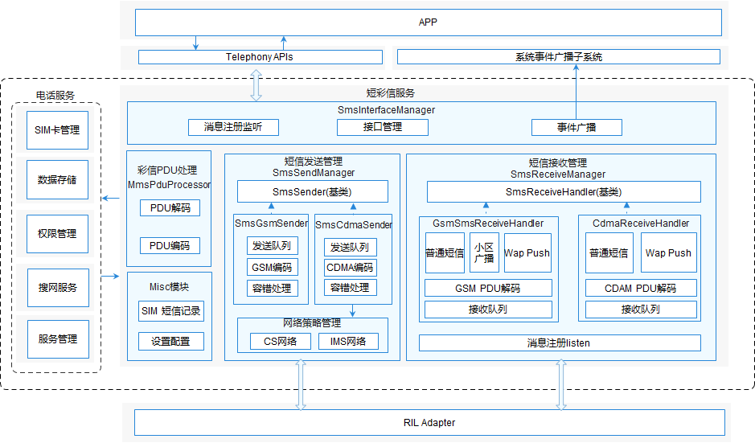

# 短彩信<a name="ZH-CN_TOPIC_0000001105544742"></a>

-   [简介](#section117mcpsimp)
-   [目录](#section125mcpsimp)
-   [约束](#section129mcpsimp)
-   [接口说明](#section134mcpsimp)
-   [使用说明](#section170mcpsimp)
    -   [发送短信](#section172mcpsimp)
    -   [创建ShortMessage对象](#section181mcpsimp)

-   [相关仓](#section189mcpsimp)

## 简介<a name="section117mcpsimp"></a>

短彩信业务为移动数据用户提供短信收发和彩信编解码功能。主要功能有GSM/CDMA短信收发、短信PDU（Protocol data unit，协议数据单元）编解码、Wap Push接收处理 、小区广播接收、彩信通知、 彩信编解码和SIM短信记录增删改查等

**图 1**  短彩信模块架构图<a name="fig420553511549"></a>


短彩信模块由接口管理类、短信发送管理类、短信接收管理类，和彩信编解码工具类组成。其中：

-   接口管理类：SmsInterfaceManager 负责对外提供短信发送、SIM短信记录操作和配置相关接口，负责创建SmsSendManager 和SmsReceiveManager 对象。
-   短信发送管理类： SmsSendManager 负责listen IMS网络状态；创建GSM\(GsmSmsSender\) 和CDMA\(CdmaSmsSender\) 的短信发送器对象，并根据网络制式调度对应发送对象发送短信功能。
-   短信接收管理类： SmsReceiveManager 负责短信接收，listen来自RIL层的新短信信息；创建GSM\(GsmSmsReceiveHander\) 和CDMA\(CdmaSmsReceiveHandler\) 对象；创建SmsWapPushHandler 和SmsCellBroadcastHandler 对象。
-   彩信编解码类：负责彩信PDU的编解码处理。

## 目录<a name="section125mcpsimp"></a>

```
/OpenHarmony_Standard_System/base/telephony/sms_mms
├─ interfaces               # 对外暴露的接口
│  └─ kits
├─ sa_profile               # 启动配置文件
├─ services                 # 服务内部代码
│  ├─ include               # 头文件目录
│  ├─ cdma                  # CDMA制式源文件
│  └─ gsm                   # GSM制式源文件
├─ test                     # 单元测试目录
└─ utils                    # 通用工具相关
```

## 约束<a name="section129mcpsimp"></a>

-   开发语言：JavaScript。
-   软件上，需要与以下服务配合使用：Telephony核心服务（core\_service）；依赖[glib](https://gitlab.gnome.org/GNOME/glib)库。
-   硬件上，需要搭载的设备支持以下硬件：可以进行独立蜂窝通信的Modem以及SIM卡。

## 接口说明<a name="section134mcpsimp"></a>

**表 1**  短彩信对外提供的接口

<a name="table136mcpsimp"></a>
<table><thead align="left"><tr id="row142mcpsimp"><th class="cellrowborder" valign="top" width="33.33333333333333%" id="mcps1.2.4.1.1"><p id="entry143mcpsimpp0"><a name="entry143mcpsimpp0"></a><a name="entry143mcpsimpp0"></a>接口名称</p>
</th>
<th class="cellrowborder" valign="top" width="33.33333333333333%" id="mcps1.2.4.1.2"><p id="entry144mcpsimpp0"><a name="entry144mcpsimpp0"></a><a name="entry144mcpsimpp0"></a>接口描述</p>
</th>
<th class="cellrowborder" valign="top" width="33.33333333333333%" id="mcps1.2.4.1.3"><p id="entry145mcpsimpp0"><a name="entry145mcpsimpp0"></a><a name="entry145mcpsimpp0"></a>所需权限</p>
</th>
</tr>
</thead>
<tbody><tr id="row146mcpsimp"><td class="cellrowborder" valign="top" width="33.33333333333333%" headers="mcps1.2.4.1.1 "><p id="p1011717318415"><a name="p1011717318415"></a><a name="p1011717318415"></a>function sendMessage(options: SendMessageOptions): void;</p>
</td>
<td class="cellrowborder" valign="top" width="33.33333333333333%" headers="mcps1.2.4.1.2 "><p id="entry148mcpsimpp0"><a name="entry148mcpsimpp0"></a><a name="entry148mcpsimpp0"></a>发送短信，包括长短信、普通短信和数据短信。</p>
</td>
<td class="cellrowborder" valign="top" width="33.33333333333333%" headers="mcps1.2.4.1.3 "><p id="entry149mcpsimpp0"><a name="entry149mcpsimpp0"></a><a name="entry149mcpsimpp0"></a>SystemPermission.SEND_MESSAGES</p>
</td>
</tr>
<tr id="row166mcpsimp"><td class="cellrowborder" valign="top" width="33.33333333333333%" headers="mcps1.2.4.1.1 "><p id="entry167mcpsimpp0"><a name="entry167mcpsimpp0"></a><a name="entry167mcpsimpp0"></a>function createMessage(pdu: Array&lt;number&gt;, specification: string, callback: AsyncCallback&lt;ShortMessage&gt;): void;</p>
</td>
<td class="cellrowborder" valign="top" width="33.33333333333333%" headers="mcps1.2.4.1.2 "><p id="p43948592416"><a name="p43948592416"></a><a name="p43948592416"></a>通过pdu 创建解析ShortMessage对象</p>
</td>
<td class="cellrowborder" valign="top" width="33.33333333333333%" headers="mcps1.2.4.1.3 "><p id="entry169mcpsimpp0"><a name="entry169mcpsimpp0"></a><a name="entry169mcpsimpp0"></a>无</p>
</td>
</tr>
</tbody>
</table>

**表 2**  发送短信接口参数SendMessageOptions说明

<a name="table137771821149"></a>
<table><thead align="left"><tr id="row16777142181416"><th class="cellrowborder" valign="top" width="25%" id="mcps1.2.5.1.1"><p id="p1677762111420"><a name="p1677762111420"></a><a name="p1677762111420"></a>参数</p>
</th>
<th class="cellrowborder" valign="top" width="25%" id="mcps1.2.5.1.2"><p id="p32826484210"><a name="p32826484210"></a><a name="p32826484210"></a>类型</p>
</th>
<th class="cellrowborder" valign="top" width="25%" id="mcps1.2.5.1.3"><p id="p117778231415"><a name="p117778231415"></a><a name="p117778231415"></a>描述</p>
</th>
<th class="cellrowborder" valign="top" width="25%" id="mcps1.2.5.1.4"><p id="p1725516817152"><a name="p1725516817152"></a><a name="p1725516817152"></a>是否必填</p>
</th>
</tr>
</thead>
<tbody><tr id="row1577719210142"><td class="cellrowborder" valign="top" width="25%" headers="mcps1.2.5.1.1 "><p id="p197771201411"><a name="p197771201411"></a><a name="p197771201411"></a>slotId</p>
</td>
<td class="cellrowborder" valign="top" width="25%" headers="mcps1.2.5.1.2 "><p id="p16282184822111"><a name="p16282184822111"></a><a name="p16282184822111"></a>number</p>
</td>
<td class="cellrowborder" valign="top" width="25%" headers="mcps1.2.5.1.3 "><p id="p07777221417"><a name="p07777221417"></a><a name="p07777221417"></a>卡槽id</p>
</td>
<td class="cellrowborder" valign="top" width="25%" headers="mcps1.2.5.1.4 "><p id="p22552080151"><a name="p22552080151"></a><a name="p22552080151"></a>是</p>
</td>
</tr>
<tr id="row177779231416"><td class="cellrowborder" valign="top" width="25%" headers="mcps1.2.5.1.1 "><p id="p12777928146"><a name="p12777928146"></a><a name="p12777928146"></a>destinationHost</p>
</td>
<td class="cellrowborder" valign="top" width="25%" headers="mcps1.2.5.1.2 "><p id="p19282948182112"><a name="p19282948182112"></a><a name="p19282948182112"></a>string</p>
</td>
<td class="cellrowborder" valign="top" width="25%" headers="mcps1.2.5.1.3 "><p id="p157771125144"><a name="p157771125144"></a><a name="p157771125144"></a>接收端的电话号码</p>
</td>
<td class="cellrowborder" valign="top" width="25%" headers="mcps1.2.5.1.4 "><p id="p192550811156"><a name="p192550811156"></a><a name="p192550811156"></a>是</p>
</td>
</tr>
<tr id="row20777162111419"><td class="cellrowborder" valign="top" width="25%" headers="mcps1.2.5.1.1 "><p id="p1777814218147"><a name="p1777814218147"></a><a name="p1777814218147"></a>serviceCenter</p>
</td>
<td class="cellrowborder" valign="top" width="25%" headers="mcps1.2.5.1.2 "><p id="p0282348112110"><a name="p0282348112110"></a><a name="p0282348112110"></a>string</p>
</td>
<td class="cellrowborder" valign="top" width="25%" headers="mcps1.2.5.1.3 "><p id="p137781826141"><a name="p137781826141"></a><a name="p137781826141"></a>短信中心服务地址</p>
</td>
<td class="cellrowborder" valign="top" width="25%" headers="mcps1.2.5.1.4 "><p id="p1025511815152"><a name="p1025511815152"></a><a name="p1025511815152"></a>否</p>
</td>
</tr>
<tr id="row187781529145"><td class="cellrowborder" valign="top" width="25%" headers="mcps1.2.5.1.1 "><p id="p1377810211419"><a name="p1377810211419"></a><a name="p1377810211419"></a>content</p>
</td>
<td class="cellrowborder" valign="top" width="25%" headers="mcps1.2.5.1.2 "><p id="p6282648152118"><a name="p6282648152118"></a><a name="p6282648152118"></a>content | Array&lt;number&gt;</p>
</td>
<td class="cellrowborder" valign="top" width="25%" headers="mcps1.2.5.1.3 "><p id="p47789219147"><a name="p47789219147"></a><a name="p47789219147"></a>短信内容</p>
</td>
<td class="cellrowborder" valign="top" width="25%" headers="mcps1.2.5.1.4 "><p id="p325517891510"><a name="p325517891510"></a><a name="p325517891510"></a>是</p>
</td>
</tr>
<tr id="row37780215141"><td class="cellrowborder" valign="top" width="25%" headers="mcps1.2.5.1.1 "><p id="p37784221410"><a name="p37784221410"></a><a name="p37784221410"></a>destinationPort</p>
</td>
<td class="cellrowborder" valign="top" width="25%" headers="mcps1.2.5.1.2 "><p id="p1428274815211"><a name="p1428274815211"></a><a name="p1428274815211"></a>number</p>
</td>
<td class="cellrowborder" valign="top" width="25%" headers="mcps1.2.5.1.3 "><p id="p87781524149"><a name="p87781524149"></a><a name="p87781524149"></a>接收端端口号</p>
</td>
<td class="cellrowborder" valign="top" width="25%" headers="mcps1.2.5.1.4 "><p id="p7255386157"><a name="p7255386157"></a><a name="p7255386157"></a>发送数据短信必填</p>
</td>
</tr>
<tr id="row14778152151417"><td class="cellrowborder" valign="top" width="25%" headers="mcps1.2.5.1.1 "><p id="p1877814231418"><a name="p1877814231418"></a><a name="p1877814231418"></a>sendCallback</p>
</td>
<td class="cellrowborder" valign="top" width="25%" headers="mcps1.2.5.1.2 "><p id="p3283448172111"><a name="p3283448172111"></a><a name="p3283448172111"></a>AsyncCallback&lt;ISendShortMessageCallback&gt;</p>
</td>
<td class="cellrowborder" valign="top" width="25%" headers="mcps1.2.5.1.3 "><p id="p16778182121416"><a name="p16778182121416"></a><a name="p16778182121416"></a>发送结果回调</p>
</td>
<td class="cellrowborder" valign="top" width="25%" headers="mcps1.2.5.1.4 "><p id="p7255108141513"><a name="p7255108141513"></a><a name="p7255108141513"></a>是</p>
</td>
</tr>
<tr id="row107782241418"><td class="cellrowborder" valign="top" width="25%" headers="mcps1.2.5.1.1 "><p id="p147781321142"><a name="p147781321142"></a><a name="p147781321142"></a>deliveryCallback</p>
</td>
<td class="cellrowborder" valign="top" width="25%" headers="mcps1.2.5.1.2 "><p id="p172835481214"><a name="p172835481214"></a><a name="p172835481214"></a>AsyncCallback&lt;IDeliveryShortMessageCallback&gt;</p>
</td>
<td class="cellrowborder" valign="top" width="25%" headers="mcps1.2.5.1.3 "><p id="p5778624149"><a name="p5778624149"></a><a name="p5778624149"></a>送达报告回调</p>
</td>
<td class="cellrowborder" valign="top" width="25%" headers="mcps1.2.5.1.4 "><p id="p172553821519"><a name="p172553821519"></a><a name="p172553821519"></a>是</p>
</td>
</tr>
</tbody>
</table>

**表 3**  ISendShortMessageCallback类型说明

<a name="table6490122972417"></a>
<table><thead align="left"><tr id="row194901529162416"><th class="cellrowborder" valign="top" width="33.33333333333333%" id="mcps1.2.4.1.1"><p id="p849172910245"><a name="p849172910245"></a><a name="p849172910245"></a>参数</p>
</th>
<th class="cellrowborder" valign="top" width="33.33333333333333%" id="mcps1.2.4.1.2"><p id="p849182916242"><a name="p849182916242"></a><a name="p849182916242"></a>类型</p>
</th>
<th class="cellrowborder" valign="top" width="33.33333333333333%" id="mcps1.2.4.1.3"><p id="p144911029162413"><a name="p144911029162413"></a><a name="p144911029162413"></a>描述</p>
</th>
</tr>
</thead>
<tbody><tr id="row16491142916241"><td class="cellrowborder" valign="top" width="33.33333333333333%" headers="mcps1.2.4.1.1 "><p id="p549162942410"><a name="p549162942410"></a><a name="p549162942410"></a>result</p>
</td>
<td class="cellrowborder" valign="top" width="33.33333333333333%" headers="mcps1.2.4.1.2 "><p id="p144911129112418"><a name="p144911129112418"></a><a name="p144911129112418"></a>SendSmsResult</p>
</td>
<td class="cellrowborder" valign="top" width="33.33333333333333%" headers="mcps1.2.4.1.3 "><p id="p14491129172419"><a name="p14491129172419"></a><a name="p14491129172419"></a>发送结果</p>
</td>
</tr>
<tr id="row204911029112418"><td class="cellrowborder" valign="top" width="33.33333333333333%" headers="mcps1.2.4.1.1 "><p id="p4491172917241"><a name="p4491172917241"></a><a name="p4491172917241"></a>url</p>
</td>
<td class="cellrowborder" valign="top" width="33.33333333333333%" headers="mcps1.2.4.1.2 "><p id="p1549132914244"><a name="p1549132914244"></a><a name="p1549132914244"></a>string</p>
</td>
<td class="cellrowborder" valign="top" width="33.33333333333333%" headers="mcps1.2.4.1.3 "><p id="p349115291248"><a name="p349115291248"></a><a name="p349115291248"></a>URL地址</p>
</td>
</tr>
<tr id="row19491172912247"><td class="cellrowborder" valign="top" width="33.33333333333333%" headers="mcps1.2.4.1.1 "><p id="p54911329122419"><a name="p54911329122419"></a><a name="p54911329122419"></a>isLastPart</p>
</td>
<td class="cellrowborder" valign="top" width="33.33333333333333%" headers="mcps1.2.4.1.2 "><p id="p154918290248"><a name="p154918290248"></a><a name="p154918290248"></a>boolean</p>
</td>
<td class="cellrowborder" valign="top" width="33.33333333333333%" headers="mcps1.2.4.1.3 "><p id="p104913290240"><a name="p104913290240"></a><a name="p104913290240"></a>是否是最后一条短信</p>
</td>
</tr>
</tbody>
</table>

**表 4**  SendSmsResult枚举值

<a name="table2375639122617"></a>
<table><thead align="left"><tr id="row1376123932614"><th class="cellrowborder" valign="top" width="33.33333333333333%" id="mcps1.2.4.1.1"><p id="p2376339102616"><a name="p2376339102616"></a><a name="p2376339102616"></a>名称</p>
</th>
<th class="cellrowborder" valign="top" width="33.33333333333333%" id="mcps1.2.4.1.2"><p id="p153769391263"><a name="p153769391263"></a><a name="p153769391263"></a>值</p>
</th>
<th class="cellrowborder" valign="top" width="33.33333333333333%" id="mcps1.2.4.1.3"><p id="p6376193918267"><a name="p6376193918267"></a><a name="p6376193918267"></a>描述</p>
</th>
</tr>
</thead>
<tbody><tr id="row1376103912610"><td class="cellrowborder" valign="top" width="33.33333333333333%" headers="mcps1.2.4.1.1 "><p id="p0376113932616"><a name="p0376113932616"></a><a name="p0376113932616"></a>SEND_SMS_SUCCESS</p>
</td>
<td class="cellrowborder" valign="top" width="33.33333333333333%" headers="mcps1.2.4.1.2 "><p id="p3376193932611"><a name="p3376193932611"></a><a name="p3376193932611"></a>0</p>
</td>
<td class="cellrowborder" valign="top" width="33.33333333333333%" headers="mcps1.2.4.1.3 "><p id="p1737613982617"><a name="p1737613982617"></a><a name="p1737613982617"></a>发送成功</p>
</td>
</tr>
<tr id="row20376143917261"><td class="cellrowborder" valign="top" width="33.33333333333333%" headers="mcps1.2.4.1.1 "><p id="p2037653913260"><a name="p2037653913260"></a><a name="p2037653913260"></a>SEND_SMS_FAILURE_UNKNOWN</p>
</td>
<td class="cellrowborder" valign="top" width="33.33333333333333%" headers="mcps1.2.4.1.2 "><p id="p4376139182611"><a name="p4376139182611"></a><a name="p4376139182611"></a>1</p>
</td>
<td class="cellrowborder" valign="top" width="33.33333333333333%" headers="mcps1.2.4.1.3 "><p id="p153761539102611"><a name="p153761539102611"></a><a name="p153761539102611"></a>发送失败，原因未知</p>
</td>
</tr>
<tr id="row163766391268"><td class="cellrowborder" valign="top" width="33.33333333333333%" headers="mcps1.2.4.1.1 "><p id="p1376239112618"><a name="p1376239112618"></a><a name="p1376239112618"></a>SEND_SMS_FAILURE_RADIO_OFF</p>
</td>
<td class="cellrowborder" valign="top" width="33.33333333333333%" headers="mcps1.2.4.1.2 "><p id="p1737683972619"><a name="p1737683972619"></a><a name="p1737683972619"></a>2</p>
</td>
<td class="cellrowborder" valign="top" width="33.33333333333333%" headers="mcps1.2.4.1.3 "><p id="p17376103942619"><a name="p17376103942619"></a><a name="p17376103942619"></a>发送失败，因为Modem关闭</p>
</td>
</tr>
<tr id="row837613915269"><td class="cellrowborder" valign="top" width="33.33333333333333%" headers="mcps1.2.4.1.1 "><p id="p143761039162613"><a name="p143761039162613"></a><a name="p143761039162613"></a>SEND_SMS_FAILURE_SERVICE_UNAVAILABLE</p>
</td>
<td class="cellrowborder" valign="top" width="33.33333333333333%" headers="mcps1.2.4.1.2 "><p id="p1237793992616"><a name="p1237793992616"></a><a name="p1237793992616"></a>3</p>
</td>
<td class="cellrowborder" valign="top" width="33.33333333333333%" headers="mcps1.2.4.1.3 "><p id="p537743910267"><a name="p537743910267"></a><a name="p537743910267"></a>发送失败，因为网络不可用</p>
</td>
</tr>
</tbody>
</table>

**表 5**  IDeliveryShortMessageCallback类型说明

<a name="table13234515285"></a>
<table><thead align="left"><tr id="row1432445122815"><th class="cellrowborder" valign="top" width="33.33333333333333%" id="mcps1.2.4.1.1"><p id="p1232134532811"><a name="p1232134532811"></a><a name="p1232134532811"></a>参数</p>
</th>
<th class="cellrowborder" valign="top" width="33.33333333333333%" id="mcps1.2.4.1.2"><p id="p1432114502811"><a name="p1432114502811"></a><a name="p1432114502811"></a>类型</p>
</th>
<th class="cellrowborder" valign="top" width="33.33333333333333%" id="mcps1.2.4.1.3"><p id="p123224515283"><a name="p123224515283"></a><a name="p123224515283"></a>描述</p>
</th>
</tr>
</thead>
<tbody><tr id="row183254532810"><td class="cellrowborder" valign="top" width="33.33333333333333%" headers="mcps1.2.4.1.1 "><p id="p9331453286"><a name="p9331453286"></a><a name="p9331453286"></a>pdu</p>
</td>
<td class="cellrowborder" valign="top" width="33.33333333333333%" headers="mcps1.2.4.1.2 "><p id="p333114542810"><a name="p333114542810"></a><a name="p333114542810"></a>Array&lt;number&gt;</p>
</td>
<td class="cellrowborder" valign="top" width="33.33333333333333%" headers="mcps1.2.4.1.3 "><p id="p1559582618298"><a name="p1559582618298"></a><a name="p1559582618298"></a>PDU（Protocol data unit，协议数据单元）数组</p>
</td>
</tr>
</tbody>
</table>

**表 6**  createMessage接口参数说明

<a name="table12931820163016"></a>
<table><thead align="left"><tr id="row8293152043010"><th class="cellrowborder" valign="top" width="33.33333333333333%" id="mcps1.2.4.1.1"><p id="p72931220133012"><a name="p72931220133012"></a><a name="p72931220133012"></a>参数</p>
</th>
<th class="cellrowborder" valign="top" width="33.33333333333333%" id="mcps1.2.4.1.2"><p id="p13293172053015"><a name="p13293172053015"></a><a name="p13293172053015"></a>类型</p>
</th>
<th class="cellrowborder" valign="top" width="33.33333333333333%" id="mcps1.2.4.1.3"><p id="p16293162014301"><a name="p16293162014301"></a><a name="p16293162014301"></a>描述</p>
</th>
</tr>
</thead>
<tbody><tr id="row112937206307"><td class="cellrowborder" valign="top" width="33.33333333333333%" headers="mcps1.2.4.1.1 "><p id="p13293320193019"><a name="p13293320193019"></a><a name="p13293320193019"></a>pdu</p>
</td>
<td class="cellrowborder" valign="top" width="33.33333333333333%" headers="mcps1.2.4.1.2 "><p id="p429315201307"><a name="p429315201307"></a><a name="p429315201307"></a>Array&lt;number&gt;</p>
</td>
<td class="cellrowborder" valign="top" width="33.33333333333333%" headers="mcps1.2.4.1.3 "><p id="p12293102014308"><a name="p12293102014308"></a><a name="p12293102014308"></a>PDU（Protocol data unit，协议数据单元）数组</p>
</td>
</tr>
<tr id="row6293182012308"><td class="cellrowborder" valign="top" width="33.33333333333333%" headers="mcps1.2.4.1.1 "><p id="p2293820143020"><a name="p2293820143020"></a><a name="p2293820143020"></a>specification</p>
</td>
<td class="cellrowborder" valign="top" width="33.33333333333333%" headers="mcps1.2.4.1.2 "><p id="p14293152012301"><a name="p14293152012301"></a><a name="p14293152012301"></a>string</p>
</td>
<td class="cellrowborder" valign="top" width="33.33333333333333%" headers="mcps1.2.4.1.3 "><p id="p1293420163019"><a name="p1293420163019"></a><a name="p1293420163019"></a>协议类型（3gpp或3gpp2）</p>
</td>
</tr>
</tbody>
</table>

## 使用说明<a name="section170mcpsimp"></a>

### 发送短信<a name="section172mcpsimp"></a>

以发送普通文本短信为例，主要步骤和代码如下：

1.  构造SendMessageOptions对象，传入必要的参数；若关注发送结果或送达报告，需要传入sendCallback或deliveryCallback对象。
2.  可以通过callback或者Promise的方式调用sendMessage接口。
3.  该接口为异步接口，相关执行结果会从callback中返回。

    ```
    import sms from "@ohos.telephony.sms";

    let msg: SendMessageOptions = {
      slotId: 1,
      destinationHost: '12312312312',
      content: '这是一封短信',
      sendCallback: (err, data) => {
        if (err) {
          // 接口调用失败，err非空
          console.error(`failed to send message because ${err.message}`);
          return;
        }
        // 接口调用成功，err为空
        console.log(`success to send message: ${data.result}`);
      }
    }

    // 调用接口
    sms.sendMessage(msg);
    ```


### 创建ShortMessage对象<a name="section181mcpsimp"></a>

以解析3gpp类型的PDU，调用createMessage为例，主要步骤和代码如下：

1.  构造短信的PDU，指定协议类型为3gpp或者3gpp2。
2.  可以通过callback或者Promise的方式调用createMessage接口。
3.  该接口为异步接口，成功后获取ShortMessage 对象属性来得到解析后的短信息数据。

    ```
    import sms from "@ohos.telephony.sms";

    let pdu = [80, 80, 80]; // 这里只是表示是短信PDU，并非真实短信
    let specification = "3gpp";

    // 调用接口【callback方式】
    sms.createMessage(pdu, specification, (err, value) => {
      if (err) {
        // 接口调用失败，err非空
        console.error(`failed to createMessage because ${err.message}`);
        return;
      }
      // 接口调用成功，err为空
      console.log(`success to createMessage: ${value}`);
    });

    // 调用接口【Promise方式】
    let promise = sms.createMessage(pdu, specification);
    promise.then((value) => {
      // 接口调用成功，此处可以实现成功场景分支代码。
      console.log(`success to createMessage: ${value}`);
    }).catch((err) => {
      // 接口调用失败，此处可以实现失败场景分支代码。
      console.error(`failed to createMessage because ${err.message}`);
    });
    ```


## 相关仓<a name="section189mcpsimp"></a>

电话服务子系统

telephony_sms_mms

telephony_core_service